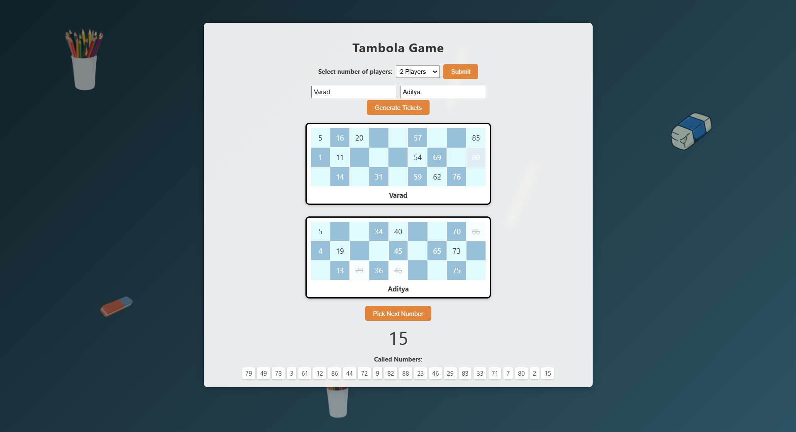

# 🎲 Tambola Web Game

## 🎮 Game Preview

## 🧠 Tech Stack Used

- HTML5
- CSS3 (Flexbox, gradients, responsive design)
- JavaScript (DOM manipulation, arrays, event handling)
- Web Speech API (voice output)
## 🌟 Core Features 

- 🎫 Dynamic generation of Tambola tickets
- 👤 Player name input and up to 6 players supported
- 🎲 Random number calling from 1 to 90
- 🏆 Automatic winner detection for:
  - Early Five
  - Top Line
  - Middle Line
  - Bottom Line
  - Full House
  - Cross-off numbers automatically when called

## 💫 Animated UI 

- 📚 Floating classroom-themed objects like pencils, erasers, and cups
- 🎨 Smooth animated background elements using CSS animations
- 🧊 Glassmorphism-inspired ticket display
- 🖼️ Gradient background and dynamic layout

## 🚀 Additional Unique Feature 

- 🗣️ Voice Assistant: Announces each called number out loud using Web Speech API
- 🥇 Badges display automatically on winning tickets for Early Five, Line wins, and Full House
- 🧠 Intelligent row-by-row win tracking
- 🪄 Smooth visual feedback and UI transitions

## 🎁 Bonus Features 

- 📢 "Congratulations" pop-up for Full House winner
- 🚫 UI Sections like "Pick Next Number" and "Called Numbers" are hidden until game starts
- 📐 Balanced and symmetrical layout based on player count
- 🧑‍🎓 Themed for educational fun with nostalgic stationery visuals

## 🙏 Acknowledgements

- This project was built as part of **VibeCoding**, an exciting tech event sponsored by **MyEquation** and hosted by **TechClub** at **Woxsen University**.
- Grateful for the opportunity to blend creativity and code in an engaging and collaborative environment.
- Special thanks to **TechClub & MyEquation** for organizing the event and providing the platform.

> Developed with enthusiasm, teamwork, and a love for code ✨
## Authors

Varad Patil 
- [Portfolio](https://varad-portfolio-540ab.web.app/)
- [GitHub](https://github.com/varadrz)
- [LinkedIn](https://www.linkedin.com/in/varadpatil665/)

